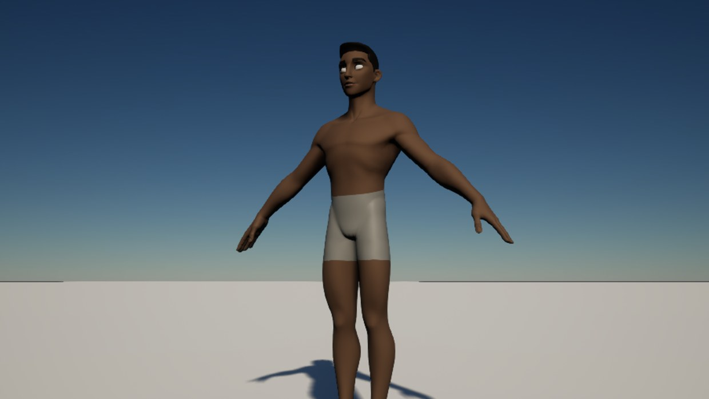
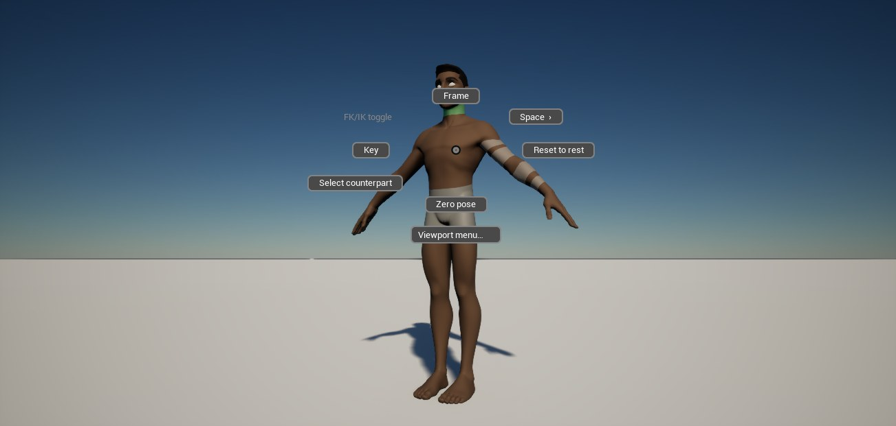
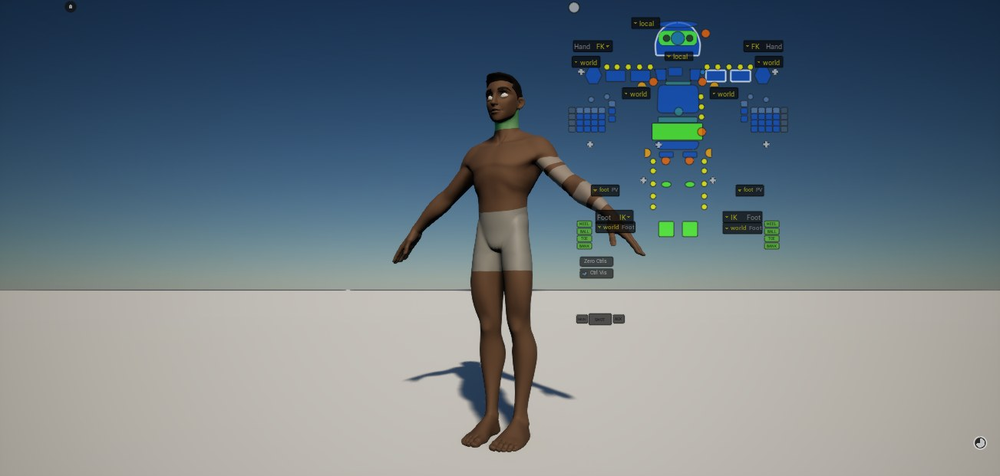
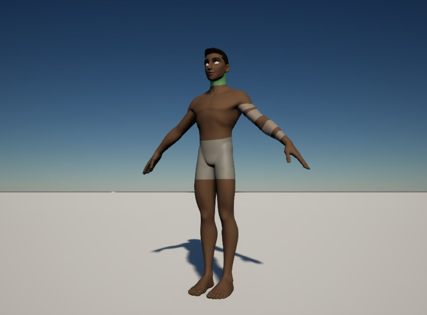

usdRig &middot; Unreal Engine 5.8

<h1 class="sb-title">The rig you built. Posed in Unreal, exactly.</h1>

RigExec runs your baked usdRig character inside Unreal: the same IK, spaces, blend shapes and
deformers usdview shows, animated with Control Rig and Sequencer. No re-rigging, no approximations.

[Get started](building.md){ .md-button .md-button--primary }
[Working in the editor](editor-workflow.md){ .md-button }

<figure class="sb-shot">
  
  <figcaption>The usdRig biped in Unreal Engine 5.8, posed by RigExec and drawn on the GPU.</figcaption>
</figure>

  <strong>Unreal Engine 5.8</strong> on Win64
  <strong>Control Rig</strong> and <strong>Sequencer</strong>
  <strong>GPU</strong> skin, motion vectors, ray tracing
  <strong>USD-space</strong> controls

<h2 class="sb-section-title">Built for animators</h2>

Everything the rig does in usdview, inside the editor you animate in.

-   :material-vector-polyline:{ .lg } **The rig, exactly**

    ---

    The baked rig evaluates in Unreal as it does in usdview: IK/FK limbs, spaces, blend shapes, wires and
    every other deformer.

-   :material-axis-arrow:{ .lg } **USD-space controls**

    ---

    Every control keeps its USD offset and value. A control's value in Anim Details is the avar usdview shows,
    so animation always matches the rig.

-   :material-chip:{ .lg } **Drawn on the GPU**

    ---

    Compute-shader normals, motion vectors for motion blur and TSR, and ray-tracing support. If the GPU path
    isn't available, a CPU fallback takes over and the component tells you so.

-   :material-gesture-tap:{ .lg } **Animator tools from usdview**

    ---

    The picker (docked or right in the viewport), Touch Pose, and the right-click marking menu.

-   :material-movie-open:{ .lg } **Sequencer and undo**

    ---

    Keys go on a Control Rig track like any other rig. Undo brings the rig back exactly, and IK/FK and space
    switches keep the limb where it is.

-   :material-cube-outline:{ .lg } **Works with Squarebit Subdivs**

    ---

    Add [Squarebit Subdivs](https://www.squarebitstudios.com/squarebit-subdivs) and the character draws as
    a subdivision surface on the GPU. Optional; RigExec runs without it.

<figure class="sb-shot">
  
</figure>

Right-click a control

### The marking menu

Flick toward a command and release: it runs with nothing ever drawn. Hold, and the ring appears so you can
read it. Key, reset, zero, frame, switch IK/FK, change space or select the mirrored control, each in a
direction your hand learns.

[The marking menu :material-arrow-right:](editor-workflow.md#the-marking-menu)

<figure class="sb-shot">
  
</figure>

Press P over the viewport

### The hover picker

The character's own picker, drawn right over the viewport with no window around it. Move, scale, fade or
collapse each tab; everywhere else the viewport still selects, drags gizmos and moves the camera. Your layout
comes back next session.

[The hover picker :material-arrow-right:](editor-workflow.md#the-hover-picker)

<figure class="sb-shot">
  
</figure>

Touch the skin

### Touch Pose

Hover the character and the region under the cursor lights; click to select the control it belongs to.
Selected regions stay lit. Manipulators always win the click, and Touch Pose steps aside while you drag or
play.

[Touch Pose :material-arrow-right:](editor-workflow.md#touch-pose)

<h2 class="sb-section-title">How it works</h2>

The rig is baked once, outside Unreal. Unreal evaluates it; it never rebuilds it.

<h4>Bake the rig</h4>

In usdRig, bake the character to a `.rigexec` and export its controls and picker.
[Preparing a rig](rig-preparation.md)

<h4>Bring it into Unreal</h4>

A setup script builds the USD-space Control Rig and places the character, drawn from the USD stage.
[Setting up](editor-workflow.md#setting-up-your-own-character)

<h4>Animate</h4>

Pose with Control Rig, the pickers, Touch Pose and the marking menu; key it in Sequencer.
[Working in the editor](editor-workflow.md)

### Works with Squarebit Subdivs

Draw the character as a Catmull-Clark subdivision surface on the GPU. Add one component; Touch Pose, the
pickers and Sequencer keep working.

[Learn about Squarebit Subdivs :material-open-in-new:](https://www.squarebitstudios.com/squarebit-subdivs){ .md-button target="_blank" rel="noopener" }

## Ready to pose?

Build the plugin and open the example biped in a couple of minutes.

[Get started](building.md){ .md-button .md-button--primary }
[View on GitHub :fontawesome-brands-github:](https://github.com/squarebit-studios/usdRig_unreal){ .md-button }

